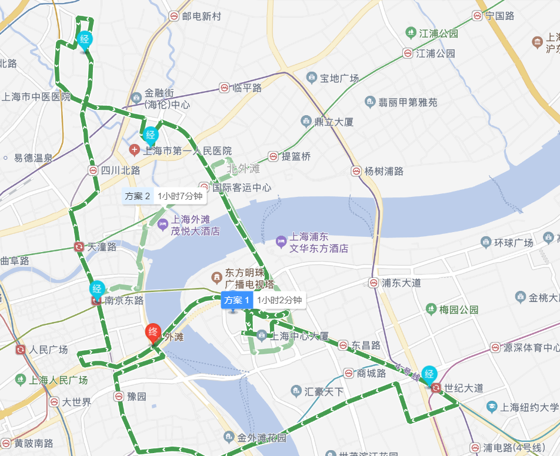

## 开始

### Tomcat

> server.xml

目录结构以及配置文件作用

核心配置文件server.xml

对应localhost地址、默认端口号


### 创建Maven项目

> 使用骨架

```new project-->maven-->maven webapp ```

```Artifact```表示项目名

```GroupId ```表示组名

> 不使用骨架

文件目录将包括src-->main/resources

### 配置tomcat

Add Configuration 中选择Tomcat Server，depolyment Artifact

解决找不到Maven的方法：ctrl+shift+a 搜索Maven Projects  添加pom.xml即可

路径可选可不选，不选则是localhost：8080

Artifact 选择war和exploded方式[区别](https://blog.csdn.net/yx1166/article/details/79500500?utm_medium=distribute.pc_relevant_download.none-task-blog-baidujs-1.nonecase&depth_1-utm_source=distribute.pc_relevant_download.none-task-blog-baidujs-1.nonecase)

