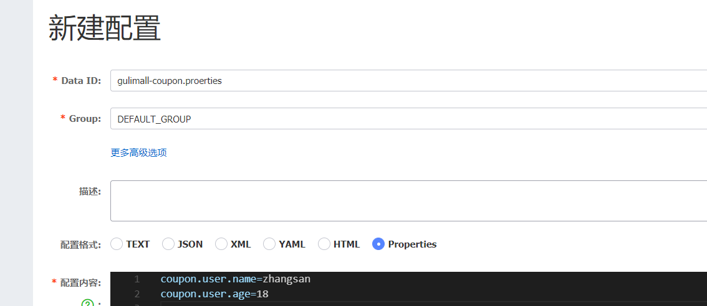

[SpringCloudAlibaba](https://github.com/alibaba/spring-cloud-alibaba)

[实例](https://blog.csdn.net/hancoder/article/details/106922139)

## 1.maven依赖

```
<dependencyManagement>
    <dependencies>
        <dependency>
            <groupId>com.alibaba.cloud</groupId>
            <artifactId>spring-cloud-alibaba-dependencies</artifactId>
            <version>2.2.3.RELEASE</version>
            <type>pom</type>
            <scope>import</scope>
        </dependency>
    </dependencies>
</dependencyManagement>
```

## 2.Nacos

### 2.1Nacos

1. 下载之后双击startup
2. 配置地址以及名字
3. 查看注册信息

```cmd
http://127.0.0.1:8848/nacos/
#账号密码均为nacos
```

4. 添加注解

```
@EnableDiscoveryClient
```

### 2.2远程调用服务

1. Nacos注册，服务发现

```
<dependency>
    <groupId>com.alibaba.cloud</groupId>
    <artifactId>spring-cloud-starter-alibaba-nacos-discovery</artifactId>
</dependency>
```

1. 引入Open-feign（按道理来引入springcloud alibaba，再引入feign自带了ribbon组件，为啥找不到）

```
 <dependency>
            <groupId>org.springframework.cloud</groupId>
            <artifactId>spring-cloud-starter-netflix-ribbon</artifactId>
        </dependency>
```

1. 在A服务用调用Service接口中方法，Service接口通过声明式调用到B服务方法

```java
package com.shaobing.gulimall.member.feign;

import com.shaobing.common.utils.R;
import org.springframework.cloud.openfeign.FeignClient;
import org.springframework.web.bind.annotation.RequestMapping;

@FeignClient("gulimall-coupon")
public interface CouponFeignService {
    @RequestMapping("/coupon/coupon/member/list")
    public R memebercoupons();
}

```

2. 开启远程调用服务

```

@EnableFeignClients(basePackages = "com.shaobing.gulimall.member.feign")
@EnableDiscoveryClient
public class GulimallMemberApplication {
    public static void main(String[] args) {
        SpringApplication.run(GulimallMemberApplication.class, args);
    }
}
```

### 2.3.配置中心

1. 通常新建一个yml启动的时候加载，如果上传到服务器那么就要重新打包部署比较麻烦
2. 创建一个bootstrap.properties，与nacos服务器相连接

```java
#名字
spring.application.name=gulimall-coupon
#地址
spring.cloud.nacos.config.server-addr=127.0.0.1:8848
```

1. 给配置中心添加一个叫数据集（Data ID）。默认规则，应用名.properties，优先使用配置中心



1. 动态获取配置

   1. @RefreshScope   动态获取并刷新配置，标注在controller上

   ```cmd
   @RefreshScope
   @RestController
   @RequestMapping("coupon/coupon")
   public class CouponController {
       @Autowired
       private CouponService couponService;
       @Value("${coupon.user.name}")
       private String name;
       @Value("${coupon.user.age}")
       private Integer age;
       @RequestMapping("/test")
       public R test(){
           return R.ok().put("name",name).put("age",age);
       }
   ```

   1. @Value("${coupon.user.name}")获取到配置

### 2.4.配置中心进阶

#### 2.4.1 命名空间配置隔离

> 不同生产环境更改一下配置，利用命名空间做环境隔离（开发， 测试，生产）

1. nacos中新建命名空间prop
2. 在配置列表prop中新建一个应用名.properties
3. 项目bootstrap.properties中配置prop，说明使用的命名空间

```java
spring.application.name=gulimall-coupon
spring.cloud.nacos.config.server-addr=127.0.0.1:8848
spring.cloud.nacos.config.namespace=f91c968e-59df-4d55-9085-13d92e84a227
```

#### 2.4.2微服务配置隔离

1. 每个微服务创建一个属于自己的命名空间
2. 新建一个以微服务名字命名的空间
3. 可以新建或者克隆一个properties文件到微服务空间中

#### 2.4.3组分离

1. 配置列表中不同命名空间，分配一个不同的组
2. 项目bootstrap.properties中配置组

```java
spring.application.name=gulimall-coupon
spring.cloud.nacos.config.server-addr=127.0.0.1:8848
spring.cloud.nacos.config.namespace=ba3e5509-8ceb-4a04-b092-6834f243a634
spring.cloud.nacos.config.group=11
```

每个微服务创建自己的命名空间，使用配置分组区分环境，dev，test，prod

### 2.5读取顺序问题

1. 正常情况会读取默认分组下的应用名.properties
2. 设置读取组为nacos上dev分组中的应用名.properties文件

```cmd
spring.application.name=gulimall-coupon
spring.cloud.nacos.config.server-addr=127.0.0.1:8848
spring.cloud.nacos.config.namespace=ba3e5509-8ceb-4a04-b092-6834f243a634
spring.cloud.nacos.config.group=dev
#spring.main.allow-bean-definition-overriding=true
spring.cloud.nacos.config.file-extension=yaml
spring.cloud.nacos.config.extension-configs[0].data-id=datasource.yaml
spring.cloud.nacos.config.extension-configs[0].group=dev
spring.cloud.nacos.config.extension-configs[0].refresh=true
spring.cloud.nacos.config.extension-configs[1].data-id=mybatis.yaml
spring.cloud.nacos.config.extension-configs[1].group=dev
spring.cloud.nacos.config.extension-configs[1].refresh=true
spring.cloud.nacos.config.extension-configs[2].data-id=other.yaml
spring.cloud.nacos.config.extension-configs[2].group=dev
spring.cloud.nacos.config.extension-configs[2].refresh=true
```

## [3.GateWay](https://spring.io/projects/spring-cloud-gateway#overview)

### 3.1依赖以及版本

```java
 #SpringBoot版本
 <version>2.3.5.RELEASE</version>
 #SpringCloud版本
<properties>
    <java.version>1.8</java.version>
    <spring-cloud.version>Hoxton.SR9</spring-cloud.version>
 </properties>
 #Gateway依赖，可以从构建项目中选择
 <dependency>
            <groupId>org.springframework.cloud</groupId>
            <artifactId>spring-cloud-starter-gateway</artifactId>
 </dependency>
```

### 3.2开启Gateway功能

1. 开启服务注册与发现

```
@EnableDiscoveryClient
配置注册中心地址
spring.cloud.nacos.discovery.server-addr=127.0.0.1:8848
spring.application.name=gulimall-gateway
server.port=88
```

2. 新建命名空间以及配置列表中添加dataId
3. bootstrap.properties配置相关信息

```
spring.cloud.nacos.config.server-addr=127.0.0.1:8848
spring.cloud.nacos.config.namespace=a6e640d5-50d7-4115-b6a9-59c50c1f6c88
spring.application.name=gulimall-gateway
```

4. 排除mybatis相关配置

```
@SpringBootApplication(exclude = {DataSourceAutoConfiguration.class})
```


## 问题

P66 @Valid无法使用 
SpringBoot2.3.0之后就不在集成Validation组件了，要么降版本，要么手动导入Spring Boot Starter Validation，注意不是自动导入的那个


网关这里，大家使用了什么版本就去看什么版本的api文档，一定要看，我就严重踩坑，我使用的是2.2.5relerase版本的，在该版本中路径重写官方改为了RewritePath=/red(?<segment>/?.*), $\{segment}，
而并非RewritePath=/red(?<segment>.*), $\{segment}，我在这里僵持了好久。。。